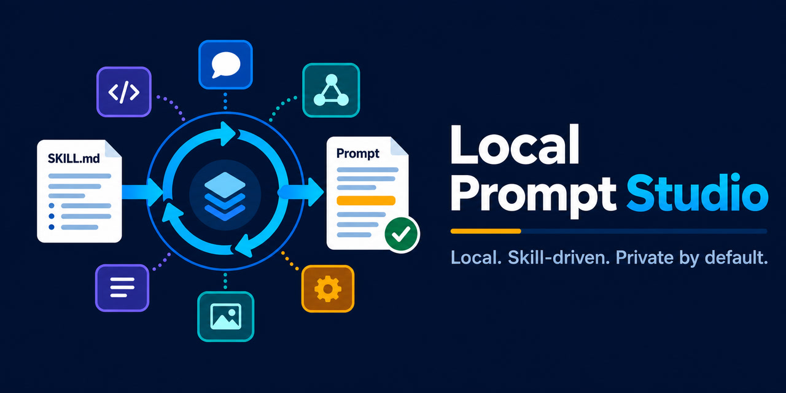

# Local Prompt Studio



[简体中文](README_zh-CN.md) · [Illustrated user guide](docs/USER_GUIDE.md) ·
[Skill format](docs/SKILL_FORMAT.md) · [Security model](docs/SECURITY_MODEL.md)

Local Prompt Studio is a private-by-default runner for prompt-writing Skills and
OpenAI-compatible local model servers. A Skill describes how to write for a model or
workflow; the studio provides the reusable plumbing: image attachments, streamed reasoning
and final output, same-turn continuation, deterministic output checks, and local history.

This project is model-neutral. It does not bundle model weights, vendor prompt guides, or a
hosted inference service.

## Why Skills?

One hard-coded system prompt cannot reliably cover image, video, audio, and language models
with different syntax and constraints. Local Prompt Studio separates those concerns:

```text
rough idea + optional images
          |
          v
SKILL.md + references + optional contract.json
          |
          v
OpenAI-compatible local server
          |
          v
streamed draft -> validation -> private local history
```

A user can install a Skill they trust, write one by hand, or ask Codex to create a Skill for
the model documentation they are allowed to use. Skill text is inspected and sent as context;
Skill scripts are never executed.

The repository includes a reviewable Codex authoring Skill at
[`codex-skills/create-prompt-skill`](codex-skills/create-prompt-skill/SKILL.md). Install that folder
in your Codex Skills directory, then invoke `$create-prompt-skill` with the target model's version,
authorized source documentation, example requests, and expected prompt shape. Codex creates the
package; Local Prompt Studio performs the independent structural checks.

## Features

- Load a Skill directory, a `SKILL.md`, or a ZIP package without extracting it.
- Inspect included files and validation rules before a model call.
- Send text and image references to OpenAI-compatible local endpoints such as LM Studio.
- Stream reasoning separately from the final answer when the server exposes it.
- Continue the same assistant turn when reasoning consumes the first token budget.
- Validate colon or Markdown section order, bounded output length, forbidden substrings, and
  attachment references.
- Save atomic, private-by-default history records containing image basenames, not copied images.
- Run through a dependency-free CLI or a Tkinter desktop UI.

Real-server behavior is tracked through privacy-safe, CI-checked
[compatibility reports](docs/COMPATIBILITY.md).

## Quick start

Python 3.11 or newer is required.

```powershell
py -3 -m venv .venv
.\.venv\Scripts\python.exe -m pip install -e .
.\.venv\Scripts\local-prompt-studio.exe --skill examples\storyboard-skill --inspect-skill
```

Start an OpenAI-compatible server, choose its model identifier, then run:

```powershell
.\.venv\Scripts\local-prompt-studio.exe `
  --skill examples\storyboard-skill `
  --idea-file examples\idea.txt `
  --base-url http://127.0.0.1:1234/v1 `
  --model your-local-model
```

For the desktop interface:

```powershell
.\launch_gui.cmd
```

On macOS or Linux, replace the Windows executable path with
`.venv/bin/local-prompt-studio`.

## Use your own Skill

The smallest package is a folder containing `SKILL.md`. Optional `references/` text files are
loaded automatically. Add `skill.json` to choose explicit files and `contract.json` to define
machine-checkable output requirements.

```text
my-model-skill/
├── SKILL.md
├── skill.json          # optional Local Prompt Studio manifest
├── contract.json       # optional validation rules
└── references/
    └── syntax.md
```

Read [the Skill format](docs/SKILL_FORMAT.md) before sharing a package. The included
[storyboard example](examples/storyboard-skill/SKILL.md) is deliberately model-neutral and
contains no third-party prompt documentation. The independent
[structured music example](examples/write-music-caption/SKILL.md) demonstrates an instrumental
music-caption workflow without bundling vendor templates, lyrics, or model documentation.

## Privacy and trust boundary

The default endpoint is loopback-only (`127.0.0.1`). Nothing is uploaded by this project
unless the user deliberately configures a remote endpoint. A selected Skill can influence
model output, so inspect it first. The loader accepts only bounded UTF-8 text files and never
runs packaged code. See [the security model](docs/SECURITY_MODEL.md) and
[security policy](SECURITY.md).

## Development

```powershell
py -3 -m pip install -e ".[dev]"
py -3 -m unittest discover -s tests -v
ruff check .
```

The repository is in alpha. Compatibility reports for additional local servers and carefully
licensed, independently authored Skills are welcome. See [CONTRIBUTING.md](CONTRIBUTING.md)
and [ROADMAP.md](ROADMAP.md). Maintainer checks and release evidence are documented in the
[maintainer runbook](docs/MAINTAINER_RUNBOOK.md).

## License

Local Prompt Studio's original code and documentation are available under the
[MIT License](LICENSE). User-supplied Skills and model services retain their own terms.
