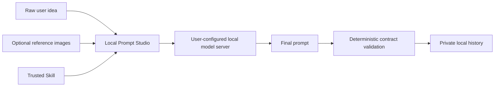
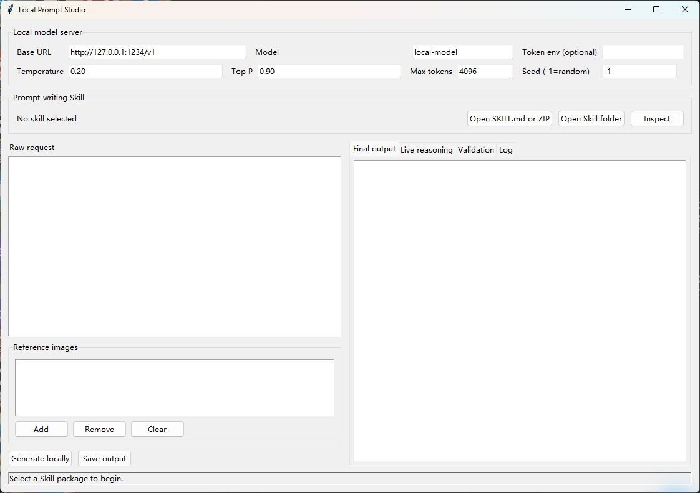
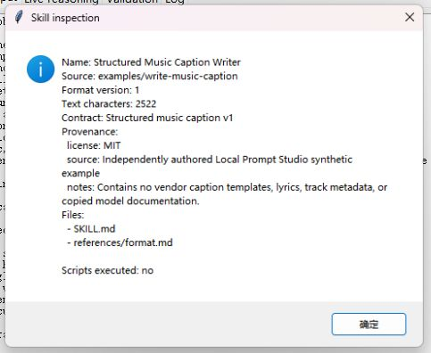
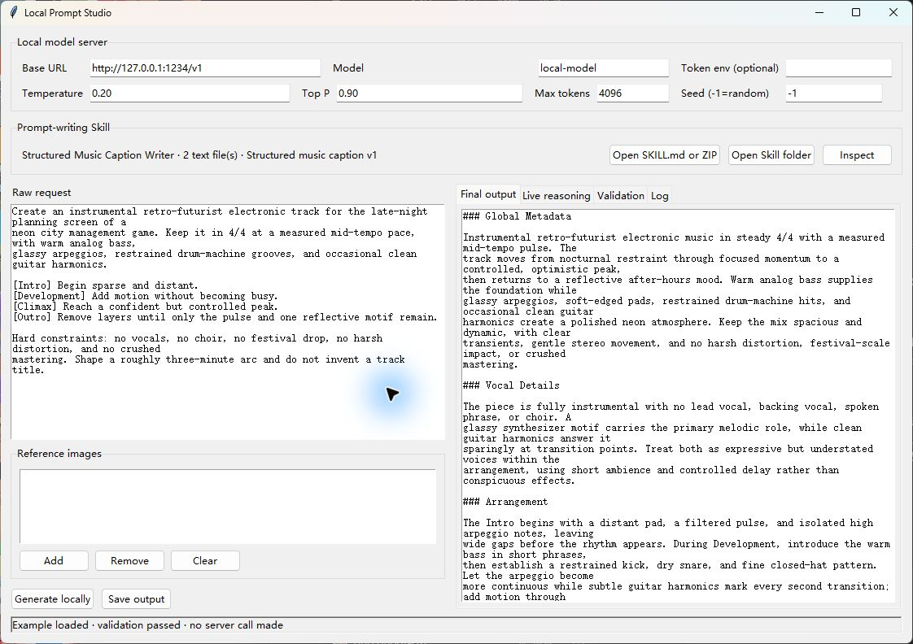
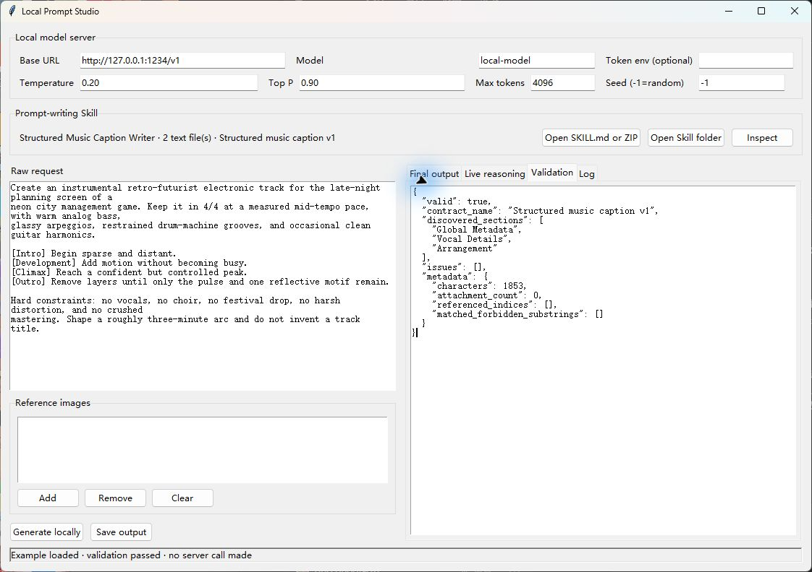

# Local Prompt Studio user guide

[简体中文教程](USER_GUIDE_zh-CN.md) · [Back to README](../README.md) ·
[Skill format](SKILL_FORMAT.md) · [Security model](SECURITY_MODEL.md)

This guide covers installation, connecting LM Studio, inspecting and loading a Skill, generating
and validating a prompt, and using the CLI. Every screenshot uses synthetic repository fixtures;
no private history, model weights, or vendor templates are included.

## Understand the workflow first



Local Prompt Studio is not an image, video, or music generator. A Skill turns a rough idea into a
prompt for a target model or workflow, while Studio sends the request to the OpenAI-compatible
endpoint that you deliberately configure.

## 1. Prerequisites

You need:

- Python 3.11 or newer;
- a trusted Skill; the repository includes synthetic storyboard and structured-music examples;
- an OpenAI-compatible service such as LM Studio for generation;
- no running model server when you only inspect a Skill or validate an existing output.

### Install on Windows

```powershell
git clone https://github.com/breadtitor/local-prompt-studio.git
Set-Location local-prompt-studio
py -3 -m venv .venv
.\.venv\Scripts\python.exe -m pip install -e .
```

Start the desktop UI:

```powershell
.\.venv\Scripts\local-prompt-studio-gui.exe
```

You can also double-click `launch_gui.cmd` from a source checkout.

### Install on macOS or Linux

```bash
git clone https://github.com/breadtitor/local-prompt-studio.git
cd local-prompt-studio
python3 -m venv .venv
source .venv/bin/activate
python -m pip install -e .
local-prompt-studio-gui
```

Some Linux distributions require their system Tkinter package, commonly named `python3-tk`.

## 2. Tour the desktop UI



| Area | Purpose |
| --- | --- |
| Local model server | Configure the endpoint, model identifier, and sampling settings |
| Prompt-writing Skill | Open a Skill folder, `SKILL.md`, or ZIP and inspect it before use |
| Raw request | Describe the rough prompt and constraints to preserve |
| Reference images | Optional; ordered as `@image_0`, `@image_1`, and so on |
| Final output | The prompt that can be saved |
| Live reasoning | Reasoning streamed by compatible servers; kept out of the final text |
| Validation | Deterministic `contract.json` results |
| Log | Skill-loading, continuation, save, and error messages |

Server fields:

- **Base URL:** defaults to the loopback-only `http://127.0.0.1:1234/v1`.
- **Model:** the identifier exposed by the server, which may differ from the model filename.
- **Token env (optional):** the *name of an environment variable* containing a token, not the
  token itself. A normal local LM Studio server usually needs no value.
- **Temperature / Top P:** randomness controls; start with `0.20` / `0.90`.
- **Max tokens:** completion budget. If reasoning consumes the first budget, Studio can continue
  the same assistant turn.
- **Seed:** `-1` means random; use a non-negative integer when the server supports reproducibility.

## 3. Connect LM Studio

LM Studio's current official instructions let you load a model and enable **Start server** in the
**Developer** page. You can also use its CLI:

```powershell
lms load
lms server start --port 1234 --bind 127.0.0.1
```

Set these values in Studio:

- Base URL: `http://127.0.0.1:1234/v1`
- Model: the model identifier shown by LM Studio
- Token env: normally empty for an unauthenticated local server

List the model identifiers visible to the server before generating:

```powershell
Invoke-RestMethod http://127.0.0.1:1234/v1/models | ConvertTo-Json -Depth 6
```

On macOS/Linux:

```bash
curl http://127.0.0.1:1234/v1/models
```

References: [LM Studio local server](https://lmstudio.ai/docs/developer/core/server) and
[OpenAI-compatible endpoints](https://lmstudio.ai/docs/developer/openai-compat). Do not bind the
server to `0.0.0.0` unless you deliberately need network access and understand the exposure.

## 4. Load and inspect a Skill

1. Select **Open Skill folder**, then choose a package such as `examples/write-music-caption`.
2. Alternatively, use **Open SKILL.md or ZIP**. ZIP packages are read without extraction.
3. Select **Inspect** before any model call and review the name, version, provenance, included
   files, and contract.



Check that:

- `Provenance` identifies a source and license;
- `Files` contains only the expected text files;
- `Scripts executed: no` is shown;
- `Contract` matches the intended output structure.

A Skill is data that influences model output. Studio never executes Skill scripts or binaries,
but you should still load only content you trust and have the right to use.

## 5. Generate your first prompt

1. Enter the request, hard constraints, prohibited content, and intended use in **Raw request**.
2. If needed, select **Add** under Reference images. The first attachment is `@image_0`.
3. Verify that the server is running and that Base URL and Model are correct.
4. Select **Generate locally**.
5. Read the prompt in **Final output** and any server-provided reasoning in **Live reasoning**.
6. Review **Validation**, then use **Save output** to export `.txt` or `.md`.

During generation, Skill text, the raw request, and selected images are sent to the configured
endpoint. If you change Base URL to a remote address, that data leaves your machine.

## 6. Structured music example

The `examples/write-music-caption` Skill turns a brief into three sections:

1. `Global Metadata`
2. `Vocal Details`
3. `Arrangement`



Try it:

1. Load the `examples/write-music-caption` folder.
2. Put `examples/music-caption-idea.txt` into **Raw request**.
3. Use **Inspect** to verify provenance and the contract.
4. Connect a local server and select **Generate locally**.
5. Use `examples/music-caption-expected-output.txt` to understand the structure, not as the only
   acceptable answer.

The screenshot shows a deterministic test fixture and made no server call. It contains no copied
MiniMax templates, lyrics, track metadata, or model documentation.

## 7. Read contract validation



Common fields in **Validation**:

- `valid`: whether the output passed;
- `discovered_sections`: headings found and their order;
- `issues`: missing or reordered headings, length limits, forbidden substrings, or bad image refs;
- `metadata.characters`: final output length;
- `matched_forbidden_substrings`: prohibited literal text that was found.

Contract validation checks structure deterministically. It does not grade creativity or guarantee
that a downstream generator will produce the desired result. If validation fails, start with the
reported `issues`, then revise the request, Skill, or output.

## 8. CLI workflow

### Inspect a Skill without calling a model

```powershell
.\.venv\Scripts\local-prompt-studio.exe `
  --skill examples\write-music-caption `
  --inspect-skill
```

### Generate through the local server and save the result

```powershell
.\.venv\Scripts\local-prompt-studio.exe `
  --skill examples\write-music-caption `
  --idea-file examples\music-caption-idea.txt `
  --base-url http://127.0.0.1:1234/v1 `
  --model YOUR_MODEL_IDENTIFIER `
  --output generated-music-caption.md `
  --show-reasoning
```

Repeat `--image` for multiple references:

```powershell
--image .\references\first.png --image .\references\second.png
```

### Validate an existing output without calling a model

```powershell
.\.venv\Scripts\local-prompt-studio.exe `
  --skill examples\write-music-caption `
  --validate-only examples\music-caption-expected-output.txt
```

On macOS/Linux, use `.venv/bin/local-prompt-studio` and `\` for line continuation. Exit code `0`
means success, `1` is a loading, endpoint, or argument error, and `2` means contract validation
failed.

## 9. Local settings and history

Default locations:

| Platform | Settings and history root |
| --- | --- |
| Windows | `%LOCALAPPDATA%\LocalPromptStudio` |
| macOS/Linux | `~/.local/share/local-prompt-studio` |

Each history record contains the idea, final output, and JSON metadata. It stores attachment
filenames but does not copy image files, and it does not save token values by default. The CLI can
disable history with `--no-save` or choose a directory with `--history-dir`.

## 10. Troubleshooting

| Symptom | What to check |
| --- | --- |
| Connection refused | Start the LM Studio server and match its port to Base URL |
| Model not found | Request `/v1/models` and use the exact returned `id` |
| Empty final output | Read Live reasoning and Log; increase Max tokens and verify final-answer support |
| Skill will not load | Use UTF-8 text and check size limits, `skill.json`, and `contract.json` |
| Validation failed | Read `issues` for headings, order, length, forbidden text, or image indexes |
| Images have no effect | Verify that the server/model accepts images and check `@image_N` ordering |
| Token env error | Enter an environment-variable name, not a raw token; local servers often need none |
| Concerned about uploads | Keep `127.0.0.1`, inspect the Skill, and do not configure a remote Base URL |

If the problem remains, open a [GitHub issue](https://github.com/breadtitor/local-prompt-studio/issues)
with a minimal synthetic reproduction, operating system, Python version, server type, and exact
error text. Do not attach private prompts, keys, histories, or media.
