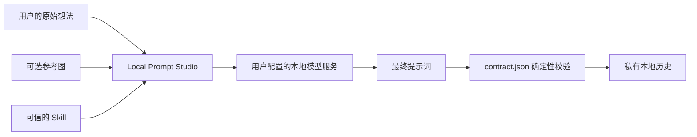

# Local Prompt Studio 中文使用教程

[English guide](USER_GUIDE.md) · [返回中文 README](../README_zh-CN.md) ·
[Skill 格式](SKILL_FORMAT.md) · [安全模型](SECURITY_MODEL.md)

本教程从零开始介绍如何安装 Local Prompt Studio、连接 LM Studio、检查并加载 Skill、
生成提示词、查看契约校验结果，以及使用命令行完成同样的工作。截图使用仓库自带的合成示例，
不包含私人历史、模型权重或厂商模板。

## 先理解工作流程



Studio 本身不是生成图片、视频或音乐的模型。它使用 Skill 把粗略想法整理成适合目标模型或
工作流的提示词，再把请求发送到你主动配置的 OpenAI-compatible 接口。

## 1. 准备环境

需要：

- Python 3.11 或更高版本；
- 一个可信的 Skill；仓库已经提供分镜与结构化音乐两个合成示例；
- 需要真正生成时，还要有一个 OpenAI-compatible 服务，例如 LM Studio；
- 只检查 Skill 或校验已有输出时，不需要启动模型服务。

### Windows 安装

```powershell
git clone https://github.com/breadtitor/local-prompt-studio.git
Set-Location local-prompt-studio
py -3 -m venv .venv
.\.venv\Scripts\python.exe -m pip install -e .
```

启动图形界面：

```powershell
.\.venv\Scripts\local-prompt-studio-gui.exe
```

在源码目录也可以双击 `launch_gui.cmd`。

### macOS 或 Linux 安装

```bash
git clone https://github.com/breadtitor/local-prompt-studio.git
cd local-prompt-studio
python3 -m venv .venv
source .venv/bin/activate
python -m pip install -e .
local-prompt-studio-gui
```

部分 Linux 发行版需要另外安装系统提供的 Tkinter 包，名称通常是 `python3-tk`。

## 2. 认识主界面


| 区域 | 用途 |
| --- | --- |
| Local model server | 设置接口地址、模型标识和采样参数 |
| Prompt-writing Skill | 打开 Skill 文件夹、`SKILL.md` 或 ZIP，并在调用前检查内容 |
| Raw request | 输入想让模型完善的粗略需求 |
| Reference images | 可选；按列表顺序作为 `@image_0`、`@image_1` 等引用 |
| Final output | 最终可保存的提示词正文 |
| Live reasoning | 服务支持时显示推理流；不会混入最终正文 |
| Validation | 显示 `contract.json` 的确定性校验报告 |
| Log | 显示加载、续写、保存和错误信息 |

服务器字段说明：

- **Base URL**：默认 `http://127.0.0.1:1234/v1`，只访问本机回环地址。
- **Model**：服务暴露的模型标识，不一定等于模型文件名。
- **Token env (optional)**：填写“保存令牌的环境变量名称”，不要直接粘贴令牌。普通本地
  LM Studio 通常留空。
- **Temperature / Top P**：控制随机性；建议先使用默认值 `0.20` / `0.90`。
- **Max tokens**：单次完成的最大 token 预算。推理用尽第一次预算时，Studio 会尝试在同一
  assistant turn 内续写。
- **Seed**：`-1` 表示随机；非负整数用于服务支持时的复现。

## 3. 连接 LM Studio

按照 LM Studio 当前官方说明，可以在 **Developer** 页面加载模型并打开 **Start server**，
也可以使用它的 CLI：

```powershell
lms load
lms server start --port 1234 --bind 127.0.0.1
```

然后在 Studio 中填写：

- Base URL：`http://127.0.0.1:1234/v1`
- Model：LM Studio 显示的 model identifier
- Token env：本机无认证服务器通常留空

在生成前可以查看服务器可见的模型：

```powershell
Invoke-RestMethod http://127.0.0.1:1234/v1/models | ConvertTo-Json -Depth 6
```

macOS/Linux 可以运行：

```bash
curl http://127.0.0.1:1234/v1/models
```

参考：[LM Studio 本地服务器](https://lmstudio.ai/docs/developer/core/server)、
[OpenAI-compatible endpoints](https://lmstudio.ai/docs/developer/openai-compat)。除非你明确需要
局域网访问并理解风险，否则不要把服务绑定到 `0.0.0.0`。

## 4. 加载并检查 Skill

1. 点击 **Open Skill folder**，选择例如 `examples/write-music-caption`。
2. 也可以点击 **Open SKILL.md or ZIP**，直接选择文件或压缩包；ZIP 不会被解压。
3. 点击 **Inspect**，在任何模型调用之前核对名称、格式版本、来源、许可证、载入文件和契约。


重点确认：

- `Provenance` 是否说明来源和许可证；
- `Files` 是否只有你预期的文本文件；
- `Scripts executed: no` 是否显示为 `no`；
- `Contract` 是否与预期输出结构一致。

Skill 是会影响模型输出的文本数据。Studio 不执行 Skill 中的脚本或二进制文件，但你仍应只
加载自己信任且有权使用的内容。

## 5. 第一次生成

1. 在 **Raw request** 输入需求，包括必须保留的约束、禁止内容和输出用途。
2. 如需参考图，点击 **Add**。列表中的第一张图是 `@image_0`，第二张是 `@image_1`。
3. 确认服务器已启动、Base URL 和 Model 正确。
4. 点击 **Generate locally**。
5. 在 **Final output** 查看正文，在 **Live reasoning** 查看服务返回的推理流。
6. 查看 **Validation**；通过后可以点击 **Save output** 导出 `.txt` 或 `.md`。

生成时，Skill 文本、原始需求和所选参考图会发送到你配置的接口。如果把 Base URL 改成远程
地址，这些数据就会离开本机。

## 6. 结构化音乐提示词示例

仓库内置 `examples/write-music-caption`，用于把简短音乐需求整理成三个部分：

1. `Global Metadata`
2. `Vocal Details`
3. `Arrangement`


快速体验：

1. 加载 `examples/write-music-caption` 文件夹；
2. 把 `examples/music-caption-idea.txt` 的内容放进 **Raw request**；
3. 点击 **Inspect** 确认来源和契约；
4. 连接本地服务后点击 **Generate locally**；
5. 对照 `examples/music-caption-expected-output.txt` 理解结构，不要把示例当成唯一正确答案。

截图中的正文来自仓库的确定性测试 fixture，没有调用服务器，也没有复制 MiniMax 模板、歌词、
曲目元数据或模型文档。

## 7. 看懂契约校验


`Validation` 中常见字段：

- `valid`：是否通过；
- `discovered_sections`：实际找到的段落及顺序；
- `issues`：缺失标题、顺序错误、长度超限、禁止子串或图片引用错误；
- `metadata.characters`：最终正文字符数；
- `matched_forbidden_substrings`：命中的禁止字面文本。

契约校验是确定性的格式检查，不代表提示词一定有创意，也不代表目标生成模型一定会得到理想
结果。校验失败时先查看 `issues`，修改原始需求、Skill 或输出后再试。

## 8. 命令行工作流

### 不调用模型，只检查 Skill

```powershell
.\.venv\Scripts\local-prompt-studio.exe `
  --skill examples\write-music-caption `
  --inspect-skill
```

### 调用本地服务器并保存结果

```powershell
.\.venv\Scripts\local-prompt-studio.exe `
  --skill examples\write-music-caption `
  --idea-file examples\music-caption-idea.txt `
  --base-url http://127.0.0.1:1234/v1 `
  --model YOUR_MODEL_IDENTIFIER `
  --output generated-music-caption.md `
  --show-reasoning
```

多张参考图可重复使用 `--image`：

```powershell
--image .\references\first.png --image .\references\second.png
```

### 不调用模型，只校验已有输出

```powershell
.\.venv\Scripts\local-prompt-studio.exe `
  --skill examples\write-music-caption `
  --validate-only examples\music-caption-expected-output.txt
```

macOS/Linux 把可执行文件替换为 `.venv/bin/local-prompt-studio`，并使用 `\` 续行。
退出码 `0` 表示成功，`1` 表示加载、接口或参数错误，`2` 表示输出未通过契约。

## 9. 本地设置和历史

默认位置：

| 系统 | 设置与历史根目录 |
| --- | --- |
| Windows | `%LOCALAPPDATA%\LocalPromptStudio` |
| macOS/Linux | `~/.local/share/local-prompt-studio` |

每条历史包含原始想法、最终输出和 JSON 元数据。历史只记录参考图文件名，不复制图片本身；
默认不会保存令牌值。命令行可用 `--no-save` 禁止保存，或用 `--history-dir` 指定目录。

## 10. 常见问题

| 现象 | 检查方法 |
| --- | --- |
| Connection refused | 确认 LM Studio server 已启动，端口与 Base URL 一致 |
| Model not found | 请求 `/v1/models`，把返回的准确 `id` 填入 Model |
| 最终正文为空 | 查看 Live reasoning 与 Log；适当增加 Max tokens，确认模型能输出最终正文 |
| Skill 无法加载 | 使用 UTF-8 文本，检查文件大小、`skill.json` 和 `contract.json` 格式 |
| Validation failed | 查看 `issues` 中的缺失段落、顺序、长度、禁止子串或图片编号 |
| 参考图无效 | 确认模型/服务支持图片输入，并核对 `@image_N` 与附件顺序 |
| Token env 错误 | 填环境变量名而不是令牌本身；本地无认证服务通常留空 |
| 担心数据外传 | 保持 `127.0.0.1`，检查 Skill，确认没有配置远程 Base URL |

仍无法解决时，请在 [GitHub Issues](https://github.com/breadtitor/local-prompt-studio/issues)
提交最小、合成、无隐私数据的复现信息，并注明系统、Python 版本、服务类型和错误文本。
